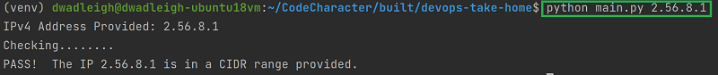
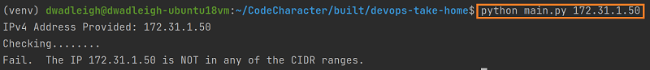
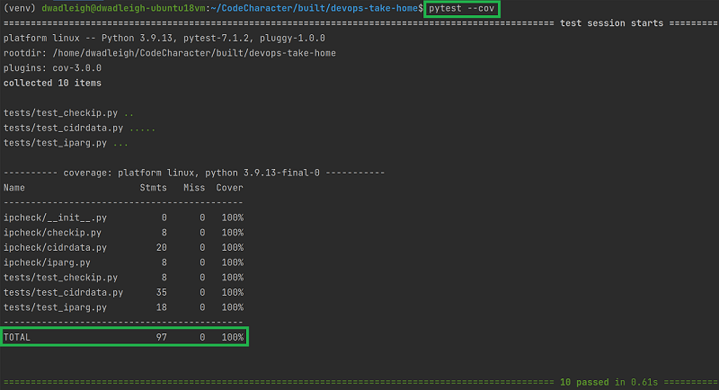

# DevOps Take Home - Python Challenge
*Note: this was a take home assignment for a DevOps interview in 2022*
> Take an IP address and determine if it's in a range of CIDRs

[](https://www.python.org/)

## Personal Statement

> Thank you for the opportunities - to learn, to grow, and to be challenged to produce a higher quality output.
> I appreciate the time, patience and consideration.
> 
> And while I may not be confused for [Kent Beck](https://www.oreilly.com/library/view/test-driven-development/0321146530/) or [Brian Okken](https://pragprog.com/titles/bopytest2/python-testing-with-pytest-second-edition/) anytime soon, 
> this exercise has helped me practically [pursue improvement](https://codecharacter.dev/so-whats-the-deal-with-code-character/).
> 
> I understand this process is to help us both see if we're a good fit.  So, in an effort to be intellectually honest, I've 
> captured my learnings to date and added notes at: [Testing](docs/Testing.md), [Test Driven Development](docs/Test-Driven-Development.md),
>  [Unit Testing](docs/Unit-Testing.md), and [Pytest Framework](docs/Pytest-Framework.md).  In completing this exercise, I've only referenced what I could
> search online.
> 
> I fully appreciate you have to *build* the team to meet the needs of the business.  I will always respect that.  In the end we both want to be each other's first choice.
> 
> I know there are things I need to work on and will continue to sharpen going forward.  And am confident I can efficiently manage any gaps.  Again, thank you for your time and the opportunity.  I look forward to meeting soon.

## Requirements

- Take IP address as a command line argument
- Get JSON data from [RIPE Network Coordination Center](https://stat.ripe.net/data/country-resource-list/data.json?resource=US&v4_format=prefix)
- Using the ipv4 block in JSON:
  - Determine whether IP address provided on CLI is in any of the CIDRs
- Output a Pass/Fail result
  - based on the presence of the IP address in the CIDR ranges

## How to Setup

Run the following commands given Python 3.7+ is installed.

Developed on Python Version: 3.9.13  (pyenv local 3.9.13)

OS X & Linux:

```sh
# Clone repo from codecharacter GitHub
git clone https://github.com/codecharacter/devops-take-home.git
cd devops-take-home

# (Recommended) Set up virtual environment to safeguard from any package conflicts with current
python3 -m venv venv
source venv/bin/activate

# For running tests, install/restore dependencies from the requirements-dev.txt file
pip install -r requirements-dev.txt

# For running the script without test framework install/restore from requirements.txt
pip install -r requirements.txt
```

## Usage Examples

```shell
# Navigate to script directory
cd devops-take-home
python main.py [IPv4 address]

Example:
python main.py 2.56.8.1
```

Example Output for a PASS:



Example Output for a Fail:



## Running Tests

```shell
Framework: pytest

# In cloned GitHub directory (you may very well be aware of all this)
cd devops-take-home

pytest  # Run all tests
pytest tests/[filename].py  # Run any individual test

# Pytest coverage report
pytest --cov
```



## Libraries/Tools Used

- [argparse](https://docs.python.org/3.9/library/argparse.html) (Std Lib)
  - The recommended command-line parsing module in the Python standard library.
  - argparse provides options: 
    - positional arguments, 
    - default value for arguments, 
    - help message, 
    - specifying data types of argument
- [ipaddress](https://docs.python.org/3.9/library/ipaddress.html) (Std Lib)
  - provides many capabilities to work with IP addresses (input) and networks (CIDRs)
  - including relevant to this task:
    - checking validity of an IP address (input)
    - iterating over all hosts in a particular subnet (CIDR)
- [requests](https://pypi.org/project/requests/) (PyPI)
  - a simple HTTP library in Python that allows sending requests easily
  - abstracts complexities of making requests so focus can be on consuming data & interacting with services
  - relevant features:
    - keep-alive & connection pooling
    - timeouts
    - sessions
- [responses](https://pypi.org/project/responses/) (PyPI)
  - a utility library for mocking out the requests Python library
  - including integration with unit test frameworks, and more:
    - responses as a pytest fixture
    - assertions on declared responses
- [pytest](https://pypi.org/project/pytest/) (PyPI)
  - testing framework used to write tests for this exercise
  - alternate testing framework available (not used): [unittest](https://docs.python.org/3.9/library/unittest.html)
  - generally, easy to use, available resources online, usable output
    - ability to filter tests
    - allows test parametrization
- [pytest-cov](https://pypi.org/project/pytest-cov/) (PyPI)
  - plugin that produces coverage reports

## Workflow for Selecting Packages

I collected this workflow from one of the [training courses](https://realpython.com/courses/managing-python-dependencies/) I completed and applying when possible.

### 1. Find Candidate Packages
   - Browse a curated list:
     - [awesome-python.com](https://awesome-python.com/), [python.libhunt.com](https://python.libhunt.com/), [python-guide.org](https://docs.python-guide.org/), [pymotw.com](https://pymotw.com/3/), [wiki.python.org](https://wiki.python.org/moin/)
   - Search Google 2-5 relevant keywords
   - Search Stack Overflow
   - Search Community Forums: [Reddit: r/Python](https://www.reddit.com/r/Python/), [HackerNews (Algolia)](https://hn.algolia.com/), Twitter
   - Search [PyPI](https://pypi.org/) directly
   . Ask a question on SO, Reddit, Twitter (slower)
### 2. Check Package Popularity
   - Check download stats if available
   - Google/Reddit/SO recommendations
   - GitHub 'stars' (visible on PyPI)
   - [python.libhunt.com](https://python.libhunt.com/) popularity indicator
### 3. Check Project Homepage
   - Is it helpful?
   - Is it well-maintained?
   - How "successful" does the project look?
### 4. Check Project README
   - Does it cover what the project does & how to install it?
   - What license is the project under?
   - Who is the author?
### 5. Is the Project Actively Maintained?
   - Skim the changelog/update history
   - Is there activity on the bug tracker?
   - When was the last commit of the project?
### 6. Spot-Check the Source Code
   - *note: looking to grow in my ability to do this; principles apply*
   - Does it follow best practices? (formatting, style, comments, docstrings)
   - Are there (automated) tests?
   - How experienced were the developers who wrote it?
   - Would I feel comfortable making small changes if I had to?
     - if I had to maintain the library going forward
### 7. Try Out a Few Candidates
   - Take the (narrowed down) list of candidates and try them out in an interpreter session.
   - Does the package install and import cleanly?
   - Do I enjoy working with the package?

## Resources

- argparse
  - [Python Docs: Argparse Tutorial](https://docs.python.org/3.9/howto/argparse.html)
  - [Read the Docs: argparse](https://pyneng.readthedocs.io/en/latest/book/additional_info/argparse.html)
- ipaddress
  - [Python Docs: An Intro to the ipaddress Module](https://docs.python.org/3.9/howto/ipaddress.html)
  - [RealPython.com: Learn IP Address Concepts with Python's ipaddress Module](https://realpython.com/python-ipaddress-module/)
- requests
  - [Read the Docs: requests](https://requests.readthedocs.io/en/latest/)
  - [RealPython.com: Python's Requests Library (Guide)](https://realpython.com/python-requests/)
- responses
  - [GitHub: responses](https://github.com/getsentry/responses)
  - [YouTube: Mocking Python Requests with Responses](https://www.youtube.com/watch?v=RNVspDHVIA0)
  - [StackOverflow: responses mock requests.ConnectionError, assert function](https://stackoverflow.com/a/62107090)
- pytest
  - [pytest Docs](https://docs.pytest.org/en/7.1.x/)
  - [RealPython.com](https://realpython.com/pytest-python-testing/)
- pytest-cov
  - [Read the Docs: pytest-cov](https://pytest-cov.readthedocs.io/en/latest/)
- \_\_main\_\_
  - [StackOverflow: How to Test or Mock if \_\_name\_\_ == "\_\_main\_\_" contents](https://stackoverflow.com/a/27084447)
    - *note: first comment had 28 upvotes, open to learning on this*
  - [Medium: How to test if \_\_name\_\_ == '\_\_main\_\_'](https://medium.com/opsops/how-to-test-if-name-main-1928367290cb)

## Release History

* 2.0
  * Submitted 7/1/2022
* 1.0
  * Submitted 6/24/2022

## Info: Dan Wadleigh

- Email: [dan@codecharacter.dev](mailto:dan@codecharacter.dev)
- Website: [www.CodeCharacter.dev](https://www.CodeCharacter.dev)
- LinkedIn: [LinkedIn Profile](https://linkedin.com/in/danwadleigh)
- Article: [So, What's the Deal with 'Code Character'?](https://codecharacter.dev/so-whats-the-deal-with-code-character/)

[https://github.com/codecharacter](https://github.com/codecharacter/)
