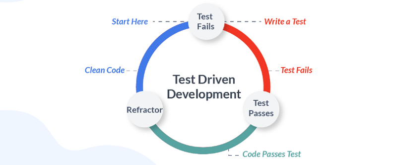

# Test Driven Development

## Modern TDD in Python (TestDriven.io)

### Objectives
- Explain how software should be tested
- Configure pytest and set up a project structure for testing
- Use pytest fixtures for managing test state and performing side effects
- Verify JSON responses against JSON Schema definitions
- Write unit tests with pytest
- Explain why it's important to focus testing efforts on testing behavior rather than implementation details

### How Should I Test My Software?

  - 3 Guidelines to Writing Valuable Tests: (opinionated)
    - Test should tell the expected behavior of the unit under test.
      - GIVEN: what are the initial conditions for the test?
      - WHEN: what is occurring that needs to be tested?
      - THEN: what is the expected response?
      - Prepare environment for testing, execute behavior, and check output meets expectations.
    - Each piece of behavior should be tested once - and only once.
      - When only a single test fails, it's much easier to find the bug.
    - Each test must be independent of other tests.
      - otherwise, have hard time maintaining and running the test suite

### Basic Setup

  - Recommended directory structure ([see article](https://testdriven.io/blog/modern-tdd/#basic-setup))
    - create folder per function
      - add \_\_init\_\_.py to folder
      - this will turn it into a package
      - add  .py file with function/code
    - add another folder for "tests"
      - add \_\_init\_\_.py to folder
      - add folder per test
        - add \_\_init\_\_.py to folder
        - add  test_.py file with testing code
          - import function from package
      - add empty conftest.py file
        - used for storing pytest fixtures
      - add empty pytest.ini config file
      - Keeping tests together in single package allows to:
        - Reuse pytest configuration across all tests
        - Reuse fixtures across all tests
        - Simplify the running of tests

### Test Fixtures

  - Fixtures are functions decorated with a @pytest.fixture decorator.
    - they are usually located inside conftest.py
    - but, they can be added to the actual test files as well
  - Notes: relevant principles to takeaway in these test cases
    - since using pydantic for data validation at runtime
      - don't need a lot of tests to cover business logic as don't need to write tests for validating data
    - if not a valid email, pydantic will raise an error
      - all that was needed was to set author attribute to EmailStr type
      - don't need to test it either b/c it's already being tested by the pydantic maintainers
  
### Expose the API

  - Introduce endpoint(s)
  - Create a folder for "schemas" inside "test_" folder
    - add JSON schema(s) to it
  - JSON Schemas are used to define the responses from API endpoints
    - install "jsonschema" Python library
    - used to validate JSON payloads against defined schema(s)
  - Notes: relevant principles to takeaway in these test cases
    - all logic covered by commands and queries
      - available actions with side effects (like mutations) represented by "commands" - creating new article
      - actions that don't have side effects, ones just reading current state, covered by "queries"
      - "command" and "query" pattern use is simplified version of CQRS pattern - combining CQRS and CRUD
  - covered happy path scenarios
  - real world must expect errors
    - need to handle errors to notify user about bad request gracefully
    - "parametrize" option in pytest
      - simplifies passing in multiple inputs to a single test
    - add error handler

### Code Coverage

- with application tested, check code coverage
- pytest plugin > pytest-cov

> *"Is 98% coverage good enough?  It probably is.  Nonetheless, remember one thing: High coverage percentage is great but the quality of your tests is much more important."* - **Jan Giacomelli (TestDriven.io)**

### Testing Pyramid

  - a framework that can help developers create high-quality software
  - from example app:
    - unit tests = tested the commands and queries
    - integration tests = tested the API endpoints
    - finished with end-to-end tests
  - Definitions:
    - Unit test - tests a single unit of code
    - Integration tests - tests that multiple units work together
    - e2e - tests the whole application against a production-like server

### What is a Unit?

  - most tutorials show unit test example that tests a single function or method
    - production code is never that simple
  - Why Test?
    - we write tests to:
      - ensure our code works as expected
      - protect our software against regressions
    - want to have more unit tests than other types of tests
    - want to find and fix the defect as fast as possible
  - What to Test?
    - should test the behavior of our software
      - shouldn't have to change tests every time there's a change to the code base
      - ex app: from a testing perspective, we don't care where the articles are stored
      - as long as the requirements don't change, a change to storage medium shouldn't break our tests
      - as long as those tests pass, we know our software meets those requirements - so it's working
  - So What is a Unit Then?
    - each function/method is technically a unit
      - but we still shouldn't test every single one of them
      - focus energy on testing functions/methods that are publicly exposed from a module/package
      - ex app: the "execute" methods
        - the "units" that should be tested, are the "execute" methods from the "commands" and "queries"
      - tests should be resistant to refactoring to the implementation details
      - if we make a breaking change inside "Article" the tests will fail
        - and that's exactly what we want

> *"Because there's one thing that we're striving for: Passing tests means working software."* - **Jan Giacomelli (TestDriven.io)** 

### When Should You Use Mocks?

  - Principles:
    - Internal:
      - mocking methods or classes inside our modules or packages produces tests that are note resistant to refactoring...
      - because they are coupled to the implementation details
      - such tests break often and are costly to maintain
    - External:
      - it makes sense to mock external resources when speed is an issue...
      - calls to external APIs, sending emails, long-running async processes, etc.
  - Key: when we break something inside (ex app) a test may still pass b/c we mocked it
    - and that's something we want to avoid
      - we want to test software behavior to ensure that it works as expected
      - in that ex case, behavior is broken but our test won't show that

### Takeaways ([full notes](https://testdriven.io/blog/modern-tdd/#takeaways))
      
  - There's no single right way to test your software.
  - Focus on the business value of your code.
  - Don't test methods just to say they're tested.  We need working software not tested methods.
  - A test is valuable only when it protects you against regressions, allows you to refactor, and provides you fast feedback.
  - The faster you notice regressions, the faster you can intercept and correct them.
  - Use mocks only when necessary (like for 3rd-party HTTP APIs).
  - Once again, your tests are a liability not an asset; they should cover your software's behavior but don't over test.

## Automated Testing and TDD (PowerfulPython.com)

### What is TDD?

  - TDD means you start working on each new feature or bugfix by writing the automated test for it *first*.
    - You run that test, verify it fails,
      - and only then do you write the actual code for the feature
    - You know you are done when the test passes.
  - Writing the test first forces you to think through the interfaces of your code
    - answering the question: how will I know my code is working?

### Unit Tests and Simple Assertions

  - define a stub for the class/method in "classname.py"
    - class defines all the attributes/methods it is expected to have
    - need a stub to verify the test can run correctly
      - and alert to fact the code isn't working yet
  - running the test and watching it fail is an important first step
    - it verifies that the test does, in fact, actually test your code
  - it's important to craft test methods to be self-contained...
    - and not depend on one being run before the other
    - the order of execution is essentially random
  - good version control commit point
  - next step is to actually make the test pass
    - this becomes next commit in version control
  - assertion takes optional final message-string argument (confirm pytest)
    - can be usefully detailed error reporting

### Fixtures and Common Test Setup

  - will find yourself writing groups of test methods that start/end with same lines of code
    - repeated code can be consolidated

### Asserting Exceptions

  - sometimes code is supposed to raise an exception
    - if that condition occurs, and code does *not* raise correct exception - it's a bug
  - How do you write test code for this situation?
    - verify behavior with special method (pytest.raises?)
    - it's used in a *with* statement in test

### Final Thoughts

  - TDD means we create the test first, and whatever stubs needed to make test run.
    - then run it, and watch it fail
    - important step: *must* run the test and see it fail
  - Don't really know if the test is correct until you verify that it *can* fail.

## Resources

- [TestDriven.io: Modern TDD in Python](https://testdriven.io/blog/modern-tdd/)
- [Powerful Python: Ch 8 - Automated Testing and TDD](https://powerfulpython.com/book/)

