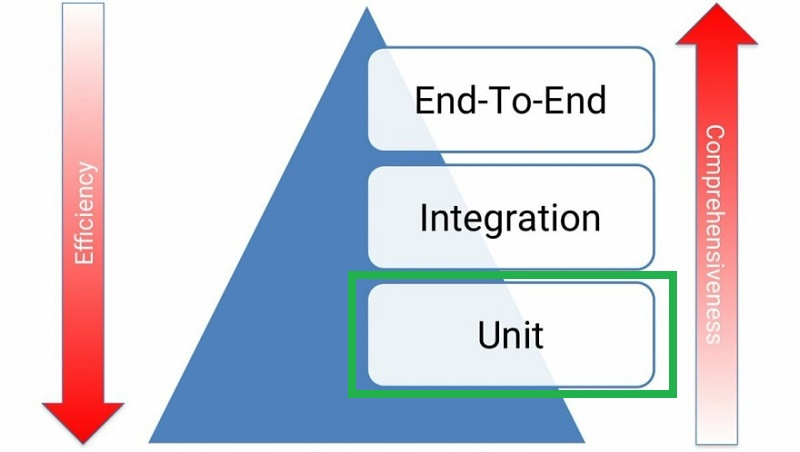

# Testing: Overview, TDD, Unit Testing, & pytest

> Learnings overview of Python testing, TDD, unit tests and the pytest framework

## Additional Notes

- [Test-Driven Development](Test-Driven-Development.md)
- [Unit Testing](Unit-Testing.md)
- [pytest Framework](Pytest-Framework.md)

## Test Pyramid - MartinFowler.com

> *"I always argue that high-level tests are there as a second line of test defense. If you get a failure in a high level test, not just do you have a bug in your functional code, you also have a missing or incorrect unit test. Thus I advise that before fixing a bug exposed by a high level test, you should replicate the bug with a unit test. Then the unit test ensures the bug stays dead."* - **Martin Fowler (Test Pyramid)**

## Testing in Python (TestDriven.io)

- **Mocking** = practice of replacing real objects with mocked objects, mimics behavior at runtime.  
  - So, instead of sending a real HTTP request over the network, we just return an expected response when the mocked method is called.
- **Code Coverage** = a metric which tells you the ratio between the number of lines executed during test runs and the total number of all lines in the code base.
  - Key: while a high coverage % is targeted, that doesn't mean tests are "good" tests
  - Testing each of the happy and exception paths of the code
- **Mutation Testing** = helps ensure that tests actually cover the full behavior of the code.
  - After each mutation, the tool runs unit tests and checks whether tests fail or not
  - If tests still pass, then the code didn't survive the mutation test.
  - Tradeoffs: improves ability to catch bugs, but is slower running entire suite many times
    - Forces testing everything, can help uncover exception paths, but will have more test cases to maintain
- **Type Checking** = verifying the type a construct matches what is expected in its usage. 
  - runtime type checkers can help to minimize the number of tests

> *"Focus your testing efforts on decreasing flakey tests.  Your tests should also be fast, isolated/independent, and deterministic/repeatable.  In the end, having confidence in your test suite will help you deploy to production more often and, more importantly, help you sleep at night."* - **Jan Giacomelli (TestDriven.io)**

## Getting Started with Testing in Python (RealPython.com)

- **Test Plan** = the parts of app want to test, order in which to test, and expected responses.
- **Integration Testing** = checks that components in the application operate with each other.
  - a major challenge is when an integration test doesn't give the right result.
  - it can be very hard to diagnose the issue without being able to isolate which part of the system is failing.
- **Unit Test** = a smaller test, checks that a single component operates in the right way.
  - helps to isolate what is broken in the application and fix it faster.
- **Test Case** = a set of conditions that need to be checked to test application functions correctly.
- **Test Runner** = application that executes test code, checks assertions, and gives test results.
  - ex: unittest (std lib), pytest
- **pytest** = testing framework with feature advantages:
  - support for built-in assert statement instead of using special self.assert*() methods
  - support for filtering for test cases
  - ability to rerun form the last failing test
  - ecosystem of plugins to extend functionality
  - and more..
- **\_\_init\_\_.py** = creating this file in a folder means the folder can be imported as a module from the parent directory.

### How to Structure a Simple Test

  - Decisions:
    - What do you want to test?
    - Are you writing a unit test or an integration test?
  - Workflow Structure:
    - Create inputs
    - Execute code being tested, capturing output
    - Compare output with an expected result
  - Behaviors to check:
    - Can it ...?
    - What happens when you provide it with a bad value?
    - What happens when ...?

### How to Write Assertions

  - last step of writing a test is to validate the output against a known response.
    - this is known as an assertion
  - Best Practices for writing assertions:
    - Make sure tests are repeatable and
      - run test multiple times to make sure it gives the same result every time
    - Try and assert results that relate to input data,
      - such as checking that the result is the actual value in example
- **Side Effects** = when executing a piece of code will alter other things in the environment.
  - Single Responsibility Principle: way to design code that is easy to write repeatable and simple unit tests for.
  - "S" in SOLID 
- <pre>if __name__ == '__main__':
      main()
  
  # command line entry point
  # means that if script executed alone by running at cmd line, it will call main()
  </pre>
- **Fixture** = the data you create as an input.
- **Parameterization** = passing different values each time running the same test and expecting the same result.
- **Handling Expected Failures**
  - when a test does throw an error, that would cause the test to fail
  - special way to handle expected errors (pytest.raises())
  - can use with any exception type needed
- **Isolating Behaviors in Application**
  - side effects make unit testing harder since, each time a test is run, it might give a different result
    - or even worse, one test could impact the state of the app and cause another test to fail
  - Techniques to Testing App Parts with Side Effects
    - Refactoring code to follow the SRP
    - Mocking out any method of function calls to remove side effects
    - Use integration testing instead of unit testing for this piece of the app
- **Folder Structure**
  - directory: tests
    - subdirectories: unit, integration
      - data directory: fixtures
- **Testing Data Driven Apps**
  - if app depends on data from a remote location, like a remote API,
    - will want to ensure tests are repeatable
    - best practice: store remote fixtures locally, so they can be recalled and sent to app
    - ex: requests library has complimentary package called responses,
      - gives ways to create response fixtures and save in test folders
- **Testing in Multiple Environments**
  - test against multiple versions of Python, or multiple versions of a package
  - ex: Tox - app that automates testing in multiple environments
- **Automating the Execution of Tests**
  - CI/CD - ex: TravisCI
- **Linters** = looks at code and comments, providing tips about mistakes, extra spaces, possibly bugs introduced.
  - improves the quality of the application
  - ex: flake8 (passive), black (aggressive)
- **Keeping Test Code Clean**
  - DRY = Don't Repeat Yourself
    - try to follow the DRY principle when writing tests
  - Test fixtures and functions > good way to produce test code that's easier to maintain
  - Readability counts
- **Testing for Performance Degradation between Changes**
  - benchmarking code
    - ex: timeit module - can time functions a number of times and give distribution
    - ex: pytest-benchmark plugin
- **Testing for Security Flaws in App**
  - checking for common security mistakes or vulnerabilities
  - ex: install bandits from PyPI
    - rules that bandit flags are configurable

## Resources

- [MartinFowler.com: Test Pyramid](https://martinfowler.com/bliki/TestPyramid.html)
- [TestDriven.io: Testing in Python](https://testdriven.io/blog/testing-python/)
- [RealPython.com: Getting Started with Testing in Python](https://realpython.com/python-testing/)

## Additional Testing Resources

### Refactoring

- [RealPython.com: Refactoring Python Applications for Simplicity](https://realpython.com/python-refactoring/)

### Assert

- [RealPython.com: Python's assert - Debug and Test Your Code Like a Pro](https://realpython.com/python-assert-statement/)

### Mocking

- [Pytest Docs: How to monkeypatch/mock modules and environments](https://docs.pytest.org/en/7.1.x/how-to/monkeypatch.html)
- [changhsinlee.com: pytest - How to Mock in Python](https://changhsinlee.com/pytest-mock/)
- [WaylonWalker.com: pytest-mock Basics](https://waylonwalker.com/til/pytest-mock-basics/)

### Fixtures

- [YouTube: Simplify Your Tests with Fixtures](https://www.youtube.com/watch?v=ErS0PPfLFLI)

### Parameterized 

- [YouTube: Multiply Your Testing Effectiveness with Parameterized Testing (Brian Okken)](https://www.youtube.com/watch?v=ErS0PPfLFLI)

### Exceptions

- [Medium.com: How to Test Exceptions in Python with Pytest and With Statement](https://pavolkutaj.medium.com/how-to-test-exceptions-in-python-with-pytest-and-with-statement-81108ef44619)
- [RealPython.com: Context Managers and Python's With Statement - Testing for Exceptions with Pytest](https://realpython.com/python-with-statement/#testing-for-exceptions-with-pytest)
- [Pybites: Assertions about Exceptions with pytest.raises()](https://pybit.es/articles/guest-pytest-raises/)

### Misc

- [Modern Python Cookbook, 2ed: Ch 11 - Testing](https://www.packtpub.com/product/modern-python-cookbook-second-edition/9781800207455)
- [Python Automation Cookbook, 2ed: Ch 12 - Automatic Testing Routines](https://www.packtpub.com/product/python-automation-cookbook/9781800207080)
- [Python for Geeks: Ch 5 - Testing and Automation with Python](https://www.packtpub.com/product/python-automation-cookbook/9781800207080)

