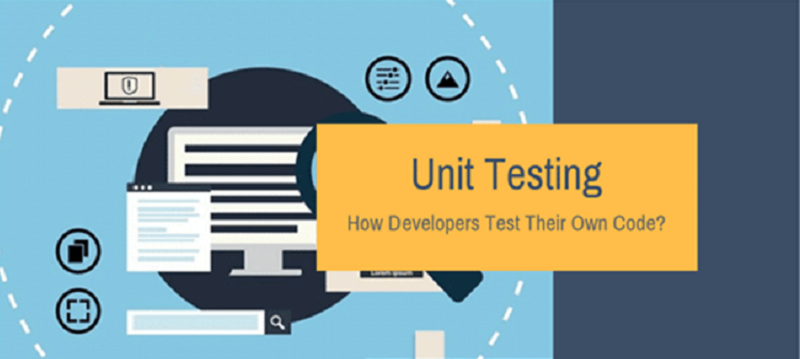

# Python Testing: Overview, Unit Tests, & pytest

> Learnings overview of Python testing, TDD, unit tests and the pytest framework

## Overview

- [Python Testing](#python-testing)
- [Test-Driven Development](#tdd)
- [Unit Tests](#unit-tests)
- [pytest Framework](#pytest)

##  Python Testing

### Lessons

### Test Pyramid - MartinFowler.com

> *"I always argue that high-level tests are there as a second line of test defense. If you get a failure in a high level test, not just do you have a bug in your functional code, you also have a missing or incorrect unit test. Thus I advise that before fixing a bug exposed by a high level test, you should replicate the bug with a unit test. Then the unit test ensures the bug stays dead."* - **Martin Fowler (Test Pyramid)**

### Testing in Python - TestDriven.io

- **Mocking** = practice of replacing real objects with mocked objects, mimics behavior at runtime.  
  - So, instead of sending a real HTTP request over the network, we just return an expected response when the mocked method is called.
- **Code Coverage** = a metric which tells you the ratio between the number of lines executed during test runs and the total number of all lines in the code base.
  - Key: while a high coverage % is targeted, that doesn't mean tests are "good" tests
  - Testing each of the happy and exception paths of the code
- **Mutation Testing** = helps ensure that tests actually cover the full behavior of the code.
  - After each mutation, the tool runs unit tests and checks whether tests fail or not
  - If tests still pass, then the code didn't survive the mutation test.
  - Tradeoffs: improves ability to catch bugs, but is slower running entire suite many times
    - Forces testing everything, can help uncover exception paths, but will have more test cases to maintain
- **Type Checking** = verifying the type a construct matches what is expected in its usage. 
  - runtime type checkers can help to minimize the number of tests

> *"Focus your testing efforts on decreasing flakey tests.  Your tests should also be fast, isolated/independent, and deterministic/repeatable.  In the end, having confidence in your test suite will help you deploy to production more often and, more importantly, help you sleep at night."* - **Jan Giacomelli (TestDriven.io)**

### Getting Started with Testing in Python - RealPython.com

- **Test Plan** = the parts of app want to test, order in which to test, and expected responses.
- **Integration Testing** = checks that components in the application operate with each other.
  - a major challenge is when an integration test doesn't give the right result.
  - it can be very hard to diagnose the issue without being able to isolate which part of the system is failing.
- **Unit Test** = a smaller test, checks that a single component operates in the right way.
  - helps to isolate what is broken in the application and fix it faster.
- **Test Case** = a set of conditions that need to be checked to test application functions correctly.
- **Test Runner** = application that executes test code, checks assertions, and gives test results.
  - ex: unittest (std lib), pytest
- **pytest** = testing framework with feature advantages:
  - support for built-in assert statement instead of using special self.assert*() methods
  - support for filtering for test cases
  - ability to rerun form the last failing test
  - ecosystem of plugins to extend functionality
  - and more..
- **\_\_init\_\_.py** = creating this file in a folder means the folder can be imported as a module from the parent directory.
- **How to Structure a Simple Test**
  - Decisions:
    - What do you want to test?
    - Are you writing a unit test or an integration test?
  - Workflow Structure:
    - Create inputs
    - Execute code being tested, capturing output
    - Compare output with an expected result
  - Behaviors to check:
    - Can it ...?
    - What happens when you provide it with a bad value?
    - What happens when ...?
- **How to Write Assertions**
  - last step of writing a test is to validate the output against a known response.
    - this is known as an assertion
  - Best Practices for writing assertions:
    - Make sure tests are repeatable and
      - run test multiple times to make sure it gives the same result every time
    - Try and assert results that relate to input data,
      - such as checking that the result is the actual value in example
- **Side Effects** = when executing a piece of code will alter other things in the environment.
  - Single Responsibility Principle: way to design code that is easy to write repeatable and simple unit tests for.
  - "S" in SOLID 
- <pre>if __name__ == '__main__':
      main()
  
  # command line entry point
  # means that if script executed alone by running at cmd line, it will call main()
  </pre>
- **Fixture** = the data you create as an input.
- **Parameterization** = passing different values each time running the same test and expecting the same result.
- **Handling Expected Failures**
  - when a test does throw an error, that would cause the test to fail
  - special way to handle expected errors (pytest.raises())
  - can use with any exception type needed
- **Isolating Behaviors in Application**
  - side effects make unit testing harder since, each time a test is run, it might give a different result
    - or even worse, one test could impact the state of the app and cause another test to fail
  - Techniques to Testing App Parts with Side Effects
    - Refactoring code to follow the SRP
    - Mocking out any method of function calls to remove side effects
    - Use integration testing instead of unit testing for this piece of the app
- **Folder Structure**
  - directory: tests
    - subdirectories: unit, integration
      - data directory: fixtures
- **Testing Data Driven Apps**
  - if app depends on data from a remote location, like a remote API,
    - will want to ensure tests are repeatable
    - best practice: store remote fixtures locally, so they can be recalled and sent to app
    - ex: requests library has complimentary package called responses,
      - gives ways to create response fixtures and save in test folders
- **Testing in Multiple Environments**
  - test against multiple versions of Python, or multiple versions of a package
  - ex: Tox - app that automates testing in multiple environments
- **Automating the Execution of Tests**
  - CI/CD - ex: TravisCI
- **Linters** = looks at code and comments, providing tips about mistakes, extra spaces, possibly bugs introduced.
  - improves the quality of the application
  - ex: flake8 (passive), black (aggressive)
- **Keeping Test Code Clean**
  - DRY = Don't Repeat Yourself
    - try to follow the DRY principle when writing tests
  - Test fixtures and functions > good way to produce test code that's easier to maintain
  - Readability counts
- **Testing for Performance Degradation between Changes**
  - benchmarking code
    - ex: timeit module - can time functions a number of times and give distribution
    - ex: pytest-benchmark plugin
- **Testing for Security Flaws in App**
  - checking for common security mistakes or vulnerabilities
  - ex: install bandits from PyPI
    - rules that bandit flags are configurable

### Resources

- [MartinFowler.com: Test Pyramid](https://martinfowler.com/bliki/TestPyramid.html)
- [TestDriven.io: Testing in Python](https://testdriven.io/blog/testing-python/)
- [RealPython.com: Getting Started with Testing in Python](https://realpython.com/python-testing/)

##  Test-Driven Development

### Lessons

### Modern TDD in Python - TestDriven.io

- **Objectives**
  - Explain how software should be tested
  - Configure pytest and set up a project structure for testing
  - Use pytest fixtures for managing test state and performing side effects
  - Verify JSON responses against JSON Schema definitions
  - Write unit tests with pytest
  - Explain why it's important to focus testing efforts on testing behavior rather than implementation details
- **How Should I Test My Software?**
  - 3 Guidelines to Writing Valuable Tests: (opinionated)
    - Test should tell the expected behavior of the unit under test.
      - GIVEN: what are the initial conditions for the test?
      - WHEN: what is occurring that needs to be tested?
      - THEN: what is the expected response?
      - Prepare environment for testing, execute behavior, and check output meets expectations.
    - Each piece of behavior should be tested once - and only once.
      - When only a single test fails, it's much easier to find the bug.
    - Each test must be independent of other tests.
      - otherwise, have hard time maintaining and running the test suite
- **Basic Setup**
  - Recommended directory structure ([see article](https://testdriven.io/blog/modern-tdd/#basic-setup))
    - create folder per function
      - add \_\_init\_\_.py to folder
      - this will turn it into a package
      - add  .py file with function/code
    - add another folder for "tests"
      - add \_\_init\_\_.py to folder
      - add folder per test
        - add \_\_init\_\_.py to folder
        - add  test_.py file with testing code
          - import function from package
      - add empty conftest.py file
        - used for storing pytest fixtures
      - add empty pytest.ini config file
      - Keeping tests together in single package allows to:
        - Reuse pytest configuration across all tests
        - Reuse fixtures across all tests
        - Simplify the running of tests
- **Test Fixtures**
  - Fixtures are functions decorated with a @pytest.fixture decorator.
    - they are usually located inside conftest.py
    - but, they can be added to the actual test files as well
  - Notes: relevant principles to takeaway in these test cases
    - since using pydantic for data validation at runtime
      - don't need a lot of tests to cover business logic as don't need to write tests for validating data
    - if not a valid email, pydantic will raise an error
      - all that was needed was to set author attribute to EmailStr type
      - don't need to test it either b/c it's already being tested by the pydantic maintainers
- **Expose the API**
  - Introduce endpoint(s)
  - Create a folder for "schemas" inside "test_" folder
    - add JSON schema(s) to it
  - JSON Schemas are used to define the responses from API endpoints
    - install "jsonschema" Python library
    - used to validate JSON payloads against defined schema(s)
  - Notes: relevant principles to takeaway in these test cases
    - all logic covered by commands and queries
      - available actions with side effects (like mutations) represented by "commands" - creating new article
      - actions that don't have side effects, ones just reading current state, covered by "queries"
      - "command" and "query" pattern use is simplified version of CQRS pattern - combining CQRS and CRUD
  - covered happy path scenarios
  - real world must expect errors
    - need to handle errors to notify user about bad request gracefully
    - "parametrize" option in pytest
      - simplifies passing in multiple inputs to a single test
    - add error handler
- **Code Coverage**
  - with application tested, check code coverage
  - pytest plugin > pytest-cov

> *"Is 98% coverage good enough?  It probably is.  Nonetheless, remember one thing: High coverage percentage is great but the quality of your tests is much more important."* - **Jan Giacomelli (TestDriven.io)**

- **Testing Pyramid**
  - a framework that can help developers create high-quality software
  - from example app:
    - unit tests = tested the commands and queries
    - integration tests = tested the API endpoints
    - finished with end-to-end tests
  - Definitions:
    - Unit test - tests a single unit of code
    - Integration tests - tests that multiple units work together
    - e2e - tests the whole application against a production-like server
- **What is a Unit?**
  - most tutorials show unit test example that tests a single function or method
    - production code is never that simple
  - Why Test?
    - we write tests to:
      - ensure our code works as expected
      - protect our software against regressions
    - want to have more unit tests than other types of tests
    - want to find and fix the defect as fast as possible
  - What to Test?
    - should test the behavior of our software
      - shouldn't have to change tests every time there's a change to the code base
      - ex app: from a testing perspective, we don't care where the articles are stored
      - as long as the requirements don't change, a change to storage medium shouldn't break our tests
      - as long as those tests pass, we know our software meets those requirements - so it's working
  - So What is a Unit Then?
    - each function/method is technically a unit
      - but we still shouldn't test every single one of them
      - focus energy on testing functions/methods that are publicly exposed from a module/package
      - ex app: the "execute" methods
        - the "units" that should be tested, are the "execute" methods from the "commands" and "queries"
      - tests should be resistant to refactoring to the implementation details
      - if we make a breaking change inside "Article" the tests will fail
        - and that's exactly what we want

> *"Because there's one thing that we're striving for: Passing tests means working software."* - **Jan Giacomelli (TestDriven.io)** 

- **When Should You Use Mocks?**
  - Principles:
    - Internal:
      - mocking methods or classes inside our modules or packages produces tests that are note resistant to refactoring...
      - because they are coupled to the implementation details
      - such tests break often and are costly to maintain
    - External:
      - it makes sense to mock external resources when speed is an issue...
      - calls to external APIs, sending emails, long-running async processes, etc.
  - Key: when we break something inside (ex app) a test may still pass b/c we mocked it
    - and that's something we want to avoid
      - we want to test software behavior to ensure that it works as expected
      - in that ex case, behavior is broken but our test won't show that
- **Takeaways** ([full notes](https://testdriven.io/blog/modern-tdd/#takeaways))
  - There's no single right way to test your software.
  - Focus on the business value of your code.
  - Don't test methods just to say they're tested.  We need working software not tested methods.
  - A test is valuable only when it protects you against regressions, allows you to refactor, and provides you fast feedback.
  - The faster you notice regressions, the faster you can intercept and correct them.
  - Use mocks only when necessary (like for 3rd-party HTTP APIs).
  - Once again, your tests are a liability not an asset; they should cover your software's behavior but don't over test.

### Automated Testing and TDD - PowerfulPython.com

- **What is TDD?**
  - TDD means you start working on each new feature or bugfix by writing the automated test for it *first*.
    - You run that test, verify it fails,
      - and only then do you write the actual code for the feature
    - You know you are done when the test passes.
  - Writing the test first forces you to think through the interfaces of your code
    - answering the question: how will I know my code is working?
- **Unit Tests and Simple Assertions**
  - define a stub for the class/method in "classname.py"
    - class defines all the attributes/methods it is expected to have
    - need a stub to verify the test can run correctly
      - and alert to fact the code isn't working yet
  - running the test and watching it fail is an important first step
    - it verifies that the test does, in fact, actually test your code
  - it's important to craft test methods to be self-contained...
    - and not depend on one being run before the other
    - the order of execution is essentially random
  - good version control commit point
  - next step is to actually make the test pass
    - this becomes next commit in version control
  - assertion takes optional final message-string argument (confirm pytest)
    - can be usefully detailed error reporting
- **Fixtures and Common Test Setup**
  - will find yourself writing groups of test methods that start/end with same lines of code
    - repeated code can be consolidated
- **Asserting Exceptions**
  - sometimes code is supposed to raise an exception
    - if that condition occurs, and code does *not* raise correct exception - it's a bug
  - How do you write test code for this situation?
    - verify behavior with special method (pytest.raises?)
    - it's used in a *with* statement in test
- **Final Thoughts**
  - TDD means we create the test first, and whatever stubs needed to make test run.
    - then run it, and watch it fail
    - important step: *must* run the test and see it fail
  - Don't really know if the test is correct until you verify that it *can* fail.

### Resources

- [TestDriven.io: Modern TDD in Python](https://testdriven.io/blog/modern-tdd/)
- [Powerful Python: Ch 8 - Automated Testing and TDD](https://powerfulpython.com/book/)

##  Unit Tests

### Lessons

### Unit Test - Martin Fowler

- **Common Elements**
  - low-level, focusing on a small part of the software system
  - written by programmers using regular tools
    - only difference is use of some unit testing framework
  - expected to be significantly faster than other kinds of tests
- **Difference**
  - what is considered to be a *unit*
  - OO design treats a class as the unit
  - procedural or functional approaches might consider a single function as a unit
  - situational - team decides what makes sense to be a unit for purposes of understanding system testing
- **Solitary or Sociable?**
  - Solitary Tests: some unit testers prefer to isolate the tested unit
  - Sociable Tests: often the tested unit relies on other units to fulfill its behavior
  - "unit testing" - tests are tests of the behavior of a single unit
    - write the tests assuming everything other than that unit is working correctly
  - schools of unit testing philosophy
    - classic and mockist styles
      - mockists insist upon solitary unit tests
      - classicists prefer sociable tests
- **Speed**
  - small scope, done by programmer, and fast
    - meaning they can be run very frequently
    - one of the key characteristics of *Self Testing Code*
  - Compile Suite
    - run whenever thinking of "compiling", even in an interpreted language (Python)
    - may not run all the unit tests
      - only need to run those tests operating over part of code currently working on
      - trade off with depth of testing with time to run test suite
  - Commit Suite
    - if using CI should run a test suite, that includes all the unit tests
    - should run several times a day
      - def before any shared commit to version control
      - the faster the commit suite is, the more often you can run it
    - Kent Beck's rule of thumb: should run in no more than 10 min
    - real point: test suites should run fast enough not discouraged from running them frequently enough
      - frequently enough so when a bug detected, there's a small amount of work to look through and find quickly

### How Unit Testing Made Me a Better Developer - SeeleyCoder.com

- **Unit Testing**
  - level of software testing where individual units/components of a software are tested
  - a unit is the smallest testable part of any software
  - simply: writing code to test your code
- **Why Should I Write Unit Tests?**
  - even if you're a *great* developer, you're still not infallible
  - writing unit tests is just as important to protect you from yourself...
    - as it is to protect your code from somebody else
  - Scenario A: data related problem
    - add some additional checks and balances
    - how certain are you this problem won't happen again?
    - how might the situation be different had then been unit tests?
  - Scenario B: return to code months later
    - hard to follow code
    - afraid to make modifications to it
    - aren't comfortable with where it's at and can't make predictions for success
    - unit tests (good ones), help allow predictability and reduce/remove fear and doubt
- **Reasons For and Benefits of Unit Tests**
  - aggregated from sources: [DZone](https://dzone.com/articles/top-8-benefits-of-unit-testing) and [CODE Magazine](https://www.codemag.com/Article/1901071/10-Reasons-Why-Unit-Testing-Matters)
    - discipline and rigor / design / quality of code
    - does it work?
    - reduce cyclomatic complexity
    - your software is used before delivery
    - documentation (self-documenting)
    - measure the effort needed to modify an existing feature
    - *enforces inversion of control/dependency injection patterns*
    - code coverage
    - performance
    - enables continuous integration (CI)
    - reduce costs
    - *debugging process*
    - *finds software bugs early*
- **Arguments Against Unit Tests**
  - It's too hard
    - don't actually understand how to do it
    - ex: writing integration tests vs unit tests
  - I don't have the time
    - exponential long-term dividends vs short-term time savings value
  - It increases maintenance
    - unit tests are written against the smallest unit of work with application
    - if smallest unit of work is too complex then you're doing it wrong
  - It doesn't guarantee success
    - practicing good SOLID design principles

> *"I mean... doesn't everybody know how to unit test?  No.  No, they don't.  I didn't and neither did you.  Everybody has to learn at some point in time."* - **Jon Seeley (SeeleyCoder.com)**

- **How to Unit Test**
  - it's difficult to talk about unit testing without referring back to SOLID design principles
    - while it's possible to unit test without following them..
    - you're really just making your life more difficult than you need to
  - key points:
    - dependency injection
    - mocking
  - want to test the smallest unit possible ... what is that?
    - depending on pl: method or function
    - that's it, anything else is an integration test
  - What is Mocking?
    - substituting or simulating the behavior of the dependency
    - in the case of testing,
      - we can mock the behavior by stating the outcome of an action
  - Sample Tests
    - samples for contrived example (see article) ... principles of mocking
    - mocking the interfaces and *only* making them do something when want them to behave a certain way
      - each of the tests then is fairly minimal
      - would write unit tests against implementations of those interfaces as well
- **How It Made Me a Better Developer**
  - began writing tests against monolithic objects despite time and work involved
  - started seeing benefits as it caught bugs and narrowed scope
  - it was difficult, it was time-consuming, but it was still beneficial
- **Found the Cadence**
  - worked with other developers and consultants
  - particular job was nitpicky about unit tests
  - two things happened:
    - experienced a unit test epiphany
    - started both learning and applying SOLID design principles
  - unit testing helped properly apply SOLID design principles to code
  - gained added benefits that unit tests bring
  - writing unit tests will definitely empower you to write well-tested "bullet-proof" code
- **Conclusion**
  - unit testing is the practice of writing code to test your code
  - done properly, a unit test is written against the smallest unit of work within your app (aka, a method)
  - in order to reduce complexity of the test,
    - mock functionality of dependencies using mocking frameworks

> *"Before you can have unit tests, your code must be unit-testable."* - **John Peterson (CODE Magazine)**

### Beginner's Guide on Unit Tests: What, Why, and How to Write Unit Tests - Danang Arbansa (GitConnected.com)

- **What is a Unit Test**
  - usually focused on the functionality of a class, function, or UI component
    - and isolated from the external system - databases, 3rd-party API
- **Why Bother to Write Unit Tests**
  - The safety net of your software 
    - writing/refactoring: make sure you do not break existing functionality
  - increase confidence in shipping to prod
- **Discover Mistakes as Early as Possible**
  - unit tests should be written in an isolated manner
    - can be executed w/o having to spin up external services
    - can run fast
    - execute tests as much as needed during dev process
- **Documentation**
  - carefully written tests can act as docs
    - describes desired behavior of a piece of software
    - helpful during code review process
      - provides guidance on software behavior
      - eliminates need for going through implementation detail to understand functionality
- **Short Intro on TDD**
  - TDD can be summarized as a red-green-refactor approach to software dev
    - Write 1 test to cover 1 requirement
      - test should fail > don't have working implementation of system (red)
    - Write implementation
      - make it pass the test (green)
    - Refactor code (if necessary)
    - Move on to next requirement, back to step 1
  - Key: let the tests drive design, not the other way around
- **Practices on Writing Unit Tests**
  - Write Meaningful Test Name
    - golden rule: clear description of output and input
    - reader should be able to understand desired behavior...
      - w/o having to read the implementation detail of system under test
  - Each Test Should Cover Only 1 Scenario
    - with multiple functionalities, if test fails, don't know which functionality is failing
- **Use AAA Pattern**
  - Arrange > Act > Assert
    - improves the readability of the test by separating parts
  - Arrange
    - preparing the necessary fixtures, mocks, stubs, and system under test
  - Act
    - executing the functionality under test
  - Assert
    - asserting the result of execution against the desired value
- **Isolate Unit from External Dependency**
  - ex: adding functionality - how do we write a test for new functionality?
    - refactor class and use dependency injection...
      - to avoid direct dependency on another unit
    - then, easily assert against the injected mock
    - decouple implementation
- **Avoid Testing Implementation Detail**
  - example of testing implementation detail:
    - asserting sequence of function calls
    - asserting internal state of a class
  - testing implementation details should be avoided...
    - b/c it creates a tight coupling b/w tests and implementation
- **Working on Legacy Code: Should I Refactor or Write Test First?**
  - it depends
  - suggest writing a test before refactoring...
    - unless it is very hard to do so
- **Conclusion**

> *"In the end, this technique (writing unit tests) would require some practice and discipline to master."* - **Danang Arbansa (GitConnected)**

### Resources

- [MartinFowler.com: Unit Test](https://martinfowler.com/bliki/UnitTest.html)
- [SeeleyCoder.com: How Unit Testing Made Me a Better Developer](https://www.seeleycoder.com/blog/how-unit-testing-made-me-better-developer/)
- [GitConnected.com: Beginner's Guide on Unit Tests](https://levelup.gitconnected.com/beginners-guide-on-unit-tests-1a6aeb3bac24)
- Examples:
  - [YouTube: How to Write Unit Tests for Existing Python Code - Part 1 (Arjan Codes)](https://www.youtube.com/watch?v=ULxMQ57engo)
  - [YouTube: How to Write Unit Tests for Existing Python Code - Part 2 (Arjan Codes)](https://www.youtube.com/watch?v=NI5IGAim8XU)

##  pytest Framework

### Lessons

### Effective Python Testing with Pytest - RealPython.com

- **What Makes *pytest* So Useful?**
  - Less Boilerplate
    - most functional tests follow Arrange-Act-Assert model
      - Arrange: set up, the conditions for the test
      - Act: by calling some function or method
      - Assert: that some end condition is true
    - pytest simplifies workflow by allowing use of normal functions and Python's *assert* keyword directly
  - Nicer Output
    - can run test suite using the *pytest* command from to-level folder of project
    - report shows:
      - system state: incl versions of Python, pytest, any plugins installed
      - rootdir: or dir to search under for config and tests
      - number of tests the runner discovered
    - failed tests gives a detailed breakdown of the failure
  - Less to Learn
    - being able to use the *assert* keyword is powerful
    - normal Python functions makes learning curve shallower
      - don't need to learn new constructs
    - each test is small and self-contained
      - see long function names and not a lot going on in functions
      - serves to keep tests isolated from each other
        - if something breaks, know exactly where problem is
  - Easier to Manage State and Dependencies
    - tests will often depend on types of data or *test doubles* that mock objects
    - tests should help make code more understandable
    - *explicit* dependency declarations
      - still reusable with *fixtures*
      - *fixtures* - functions that can create data, test doubles, or initialize system state for test suite
    - note: usu want to put tests into their own folder *tests* at root level of project
  - Easy to Filter Tests
    - ability to run a few tests on a feature
    - ways of doing this:
      - *Name-based filtering*
      - *Directory scoping*
      - *Test categorization*
        - with *marks*, or custom labels
  - Allows Test Parametrization
    - ability to eliminate duplicating test code
    - provide functions with process data
  - Has a Plugin-Based Architecture
    - open to customization and new features
    - users have developed an ecosystem of plugins
- **Fixtures: Managing State Dependencies**
  - *pytest fixtures*: a way of providing data, test doubles, or state setup to tests
    - functions that can return a wide range of values
    - each test that depends on a fixture must *explicitly* accept that fixture as an argument
    - can be used to reduce code duplication by extracting common dependencies
  - *When to Create Fixtures*
    - one of the advantages of TDD is that it helps plan out the work ahead
    - when you find yourself writing several tests that all make use of the same underlying test data
      - can pull the repeated data into a single function decorated with *@pytest.fixture* 
        - indicates that the function is a *pytest* fixture
      - can use the fixture by adding the function reference as an argument to tests
        - able to use the return value of the fixture function as the name of the fixture function
    - be sure to name fixture something specific
      - then, can quickly determine if you want to use it when writing new tests
  - *When to Avoid Fixtures*
    - good for:
      - extracting data or objects used across multiple tests
    - not good for:
      - tests that require slight variations in the data
  - *How to Use Fixtures at Scale*
    - in pytest fixtures are *modular*, means that:
      - fixtures can be imported,
      - can import other modules,
      - can depend on and import other fixtures
    - *conftest.py*
      - add general purpose fixtures to this module
      - use case: making fixture available for whole project w/o having to import it
      - use case: guarding access to resources
        - monkeypatch fixture - replace values and behaviors
- **Marks: Categorizing Tests**
  - pytest enables ability to define categories for tests, and provides options:
    - *including* categories
      - ex: *pytest -m db_access*
    - *excluding* categories
      - ex: *pytest -m "not db_access"*
  - can mark a test with any number of categories
    - marking tests useful for categorizing tests by:
      - subsystem, or
      - dependencies
  - pytest provided *marks* out of the box:
    - *skip*: skips a test unconditionally
    - *skipif*: skips a test if the expressions passed to it evaluates to True
    - *xfail*: indicates a test is expected to fail, so if test fails, overall suite can still pass
    - *parametrize*: creates multiple variants of a test w/difft values as args
    - note: to see all marks > *pytest --markers*
- **Parametrization**
  - fixtures aren't quite as useful when you have several tests with slightly diff't inputs & expected outputs
  - *parametrize* a single test definition
    - pytest will create variants of the test with parameters supplied
    - ex: *@pytest.mark.parametrize*
  - can use *parametrization* to:
    - separate test data from test behavior
      - so it's clear what the test is testing, and
      - make diff't test cases easier to read and maintain
- **Durations Reports: Fighting Slow Tests**
  - *overhead* each time switch contexts from implementation code to test code
  - *marks* can filter out slow tests when running suite
    - but will need to run at some point
  - *improve speed* of tests - know *which* tests offer biggest improvements
  - pytest can automatically record test durations and report top offenders
    - ex: *pytest --durations=5*
    - note: short durations are hidden by default
- **Useful pytest Plugins**
  - *pytest-randomly*
    - forces tests to run in a random order
    - great way to uncover tests that depend on running in a specific order
      - means they have a *stateful dependency* on some other test
  - *pytest-cov*
    - measures how well tests cover implementation code
    - ex: *pytest --cov*
  - *pytest-django*
    - provides useful fixtures and marks for dealing with Django tests
  - *pytest-bdd*
    - helps write feature tests for code
- *Conclusion*
  - *Fixtures* for handling test dependencies, state, and reusable functionality
  - *Marks* for categorizing tests and limiting access to external resources
  - *Parametrization* for reducing duplicated code between tests
  - *Durations* to identify the slowest tests
  - *Plugins* for integrating with other frameworks and testing tools

### Resources

- [Pytest Docs: Get Started, How-to Guides, Library of Examples](https://docs.pytest.org/en/7.1.x/)
- [RealPython.com: Effective Python Testing with Pytest](https://realpython.com/pytest-python-testing/)
- [Udemy: Practical Python Unit Testing with Pytest + Mocking](https://www.udemy.com/course/practical-unit-testing-for-python-with-pytest-and-mocking/)

## Additional Testing

### Lessons

### Resources

#### Refactoring

- [RealPython.com: Refactoring Python Applications for Simplicity](https://realpython.com/python-refactoring/)

#### Assert
- [RealPython.com: Python's assert - Debug and Test Your Code Like a Pro](https://realpython.com/python-assert-statement/)

#### Mocking
- [changhsinlee.com: pytest - How to Mock in Python](https://changhsinlee.com/pytest-mock/)
- [WaylonWalker.com: pytest-mock Basics](https://waylonwalker.com/til/pytest-mock-basics/)

#### Fixtures
- [YouTube: Simplify Your Tests with Fixtures](https://www.youtube.com/watch?v=ErS0PPfLFLI)

#### Parameterized 
- [YouTube: Multiply Your Testing Effectiveness with Parameterized Testing (Brian Okken)](https://www.youtube.com/watch?v=ErS0PPfLFLI)

#### Exceptions
- [Medium.com: How to Test Exceptions in Python with Pytest and With Statement](https://pavolkutaj.medium.com/how-to-test-exceptions-in-python-with-pytest-and-with-statement-81108ef44619)
- [RealPython.com: Context Managers and Python's With Statement - Testing for Exceptions with Pytest](https://realpython.com/python-with-statement/#testing-for-exceptions-with-pytest)
- [Pybites: Assertions about Exceptions with pytest.raises()](https://pybit.es/articles/guest-pytest-raises/)

#### Misc

- [Modern Python Cookbook, 2ed: Ch 11 - Testing](https://www.packtpub.com/product/modern-python-cookbook-second-edition/9781800207455)
- [Python Automation Cookbook, 2ed: Ch 12 - Automatic Testing Routines](https://www.packtpub.com/product/python-automation-cookbook/9781800207080)
- [Python for Geeks: Ch 5 - Testing and Automation with Python](https://www.packtpub.com/product/python-automation-cookbook/9781800207080)

## Summary

