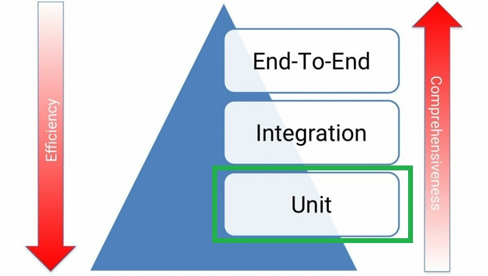
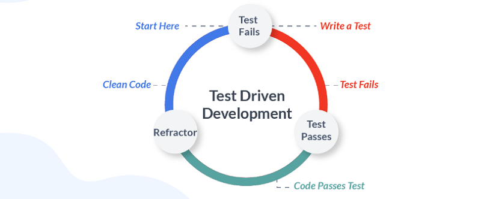

# Python Testing: Overview, Unit Tests, & pytest

> Learnings overview of Python testing, TDD, unit tests and the pytest framework

## Overview

- [Python Testing](#python-testing)
- [Test-Driven Development](#tdd)
- [Unit Tests](#unit-tests)
- [pytest Framework](#pytest)

##  Python Testing

### Lessons

### Test Pyramid - MartinFowler.com

> *"I always argue that high-level tests are there as a second line of test defense. If you get a failure in a high level test, not just do you have a bug in your functional code, you also have a missing or incorrect unit test. Thus I advise that before fixing a bug exposed by a high level test, you should replicate the bug with a unit test. Then the unit test ensures the bug stays dead."* - **Martin Fowler (Test Pyramid)**

### Testing in Python - TestDriven.io

- **Mocking** = practice of replacing real objects with mocked objects, mimics behavior at runtime.  
  - So, instead of sending a real HTTP request over the network, we just return an expected response when the mocked method is called.
- **Code Coverage** = a metric which tells you the ratio between the number of lines executed during test runs and the total number of all lines in the code base.
  - Key: while a high coverage % is targeted, that doesn't mean tests are "good" tests
  - Testing each of the happy and exception paths of the code
- **Mutation Testing** = helps ensure that tests actually cover the full behavior of the code.
  - After each mutation, the tool runs unit tests and checks whether tests fail or not
  - If tests still pass, then the code didn't survive the mutation test.
  - Tradeoffs: improves ability to catch bugs, but is slower running entire suite many times
    - Forces testing everything, can help uncover exception paths, but will have more test cases to maintain
- **Type Checking** = verifying the type a construct matches what is expected in its usage. 
  - runtime type checkers can help to minimize the number of tests

> *"Focus your testing efforts on decreasing flakey tests.  Your tests should also be fast, isolated/independent, and deterministic/repeatable.  In the end, having confidence in your test suite will help you deploy to production more often and, more importantly, help you sleep at night."* - **Jan Giacomelli (TestDriven.io)**

### Getting Started with Testing in Python - RealPython.com

- **Test Plan** = the parts of app want to test, order in which to test, and expected responses.
- **Integration Testing** = checks that components in the application operate with each other.
  - a major challenge is when an integration test doesn't give the right result.
  - it can be very hard to diagnose the issue without being able to isolate which part of the system is failing.
- **Unit Test** = a smaller test, checks that a single component operates in the right way.
  - helps to isolate what is broken in the application and fix it faster.
- **Test Case** = a set of conditions that need to be checked to test application functions correctly.
- **Test Runner** = application that executes test code, checks assertions, and gives test results.
  - ex: unittest (std lib), pytest
- **pytest** = testing framework with feature advantages:
  - support for built-in assert statement instead of using special self.assert*() methods
  - support for filtering for test cases
  - ability to rerun form the last failing test
  - ecosystem of plugins to extend functionality
  - and more..
- **\_\_init\_\_.py** = creating this file in a folder means the folder can be imported as a module from the parent directory.
- **How to Structure a Simple Test**
  - Decisions:
    - What do you want to test?
    - Are you writing a unit test or an integration test?
  - Workflow Structure:
    - Create inputs
    - Execute code being tested, capturing output
    - Compare output with an expected result
  - Behaviors to check:
    - Can it ...?
    - What happens when you provide it with a bad value?
    - What happens when ...?
- **How to Write Assertions**
  - last step of writing a test is to validate the output against a known response.
    - this is known as an assertion
  - Best Practices for writing assertions:
    - Make sure tests are repeatable and
      - run test multiple times to make sure it gives the same result every time
    - Try and assert results that relate to input data,
      - such as checking that the result is the actual value in example
- **Side Effects** = when executing a piece of code will alter other things in the environment.
  - Single Responsibility Principle: way to design code that is easy to write repeatable and simple unit tests for.
  - "S" in SOLID 
- <pre>if __name__ == '__main__':
      main()
  
  # command line entry point
  # means that if script executed alone by running at cmd line, it will call main()
  </pre>
- **Fixture** = the data you create as an input.
- **Parameterization** = passing different values each time running the same test and expecting the same result.
- **Handling Expected Failures**
  - when a test does throw an error, that would cause the test to fail
  - special way to handle expected errors (pytest.raises())
  - can use with any exception type needed
- **Isolating Behaviors in Application**
  - side effects make unit testing harder since, each time a test is run, it might give a different result
    - or even worse, one test could impact the state of the app and cause another test to fail
  - Techniques to Testing App Parts with Side Effects
    - Refactoring code to follow the SRP
    - Mocking out any method of function calls to remove side effects
    - Use integration testing instead of unit testing for this piece of the app
- **Folder Structure**
  - directory: tests
    - subdirectories: unit, integration
      - data directory: fixtures
- **Testing Data Driven Apps**
  - if app depends on data from a remote location, like a remote API,
    - will want to ensure tests are repeatable
    - best practice: store remote fixtures locally, so they can be recalled and sent to app
    - ex: requests library has complimentary package called responses,
      - gives ways to create response fixtures and save in test folders
- **Testing in Multiple Environments**
  - test against multiple versions of Python, or multiple versions of a package
  - ex: Tox - app that automates testing in multiple environments
- **Automating the Execution of Tests**
  - CI/CD - ex: TravisCI
- **Linters** = looks at code and comments, providing tips about mistakes, extra spaces, possibly bugs introduced.
  - improves the quality of the application
  - ex: flake8 (passive), black (aggressive)
- **Keeping Test Code Clean**
  - DRY = Don't Repeat Yourself
    - try to follow the DRY principle when writing tests
  - Test fixtures and functions > good way to produce test code that's easier to maintain
  - Readability counts
- **Testing for Performance Degradation between Changes**
  - benchmarking code
    - ex: timeit module - can time functions a number of times and give distribution
    - ex: pytest-benchmark plugin
- **Testing for Security Flaws in App**
  - checking for common security mistakes or vulnerabilities
  - ex: install bandits from PyPI
    - rules that bandit flags are configurable

### Resources

- [MartinFowler.com: Test Pyramid](https://martinfowler.com/bliki/TestPyramid.html)
- [TestDriven.io: Testing in Python](https://testdriven.io/blog/testing-python/)
- [RealPython.com: Getting Started with Testing in Python](https://realpython.com/python-testing/)

##  Test-Driven Development

### Lessons

### Modern TDD in Python - TestDriven.io

- **Objectives**
  - Explain how software should be tested
  - Configure pytest and set up a project structure for testing
  - Use pytest fixtures for managing test state and performing side effects
  - Verify JSON responses against JSON Schema definitions
  - Write unit tests with pytest
  - Explain why it's important to focus testing efforts on testing behavior rather than implementation details
- **How Should I Test My Software?**
  - 3 Guidelines to Writing Valuable Tests: (opinionated)
    - Test should tell the expected behavior of the unit under test.
      - GIVEN: what are the initial conditions for the test?
      - WHEN: what is occurring that needs to be tested?
      - THEN: what is the expected response?
      - Prepare environment for testing, execute behavior, and check output meets expectations.
    - Each piece of behavior should be tested once - and only once.
      - When only a single test fails, it's much easier to find the bug.
    - Each test must be independent of other tests.
      - otherwise, have hard time maintaining and running the test suite
- **Basic Setup**
  - Recommended directory structure ([see article](https://testdriven.io/blog/modern-tdd/#basic-setup))
    - create folder per function
      - add \_\_init\_\_.py to folder
      - this will turn it into a package
      - add  .py file with function/code
    - add another folder for "tests"
      - add \_\_init\_\_.py to folder
      - add folder per test
        - add \_\_init\_\_.py to folder
        - add  test_.py file with testing code
          - import function from package
      - add empty conftest.py file
        - used for storing pytest fixtures
      - add empty pytest.ini config file
      - Keeping tests together in single package allows to:
        - Reuse pytest configuration across all tests
        - Reuse fixtures across all tests
        - Simplify the running of tests
- **Test Fixtures**
  - Fixtures are functions decorated with a @pytest.fixture decorator.
    - they are usually located inside conftest.py
    - but, they can be added to the actual test files as well
  - Notes: relevant principles to takeaway in these test cases
    - since using pydantic for data validation at runtime
      - don't need a lot of tests to cover business logic as don't need to write tests for validating data
    - if not a valid email, pydantic will raise an error
      - all that was needed was to set author attribute to EmailStr type
      - don't need to test it either b/c it's already being tested by the pydantic maintainers
- **Expose the API**
  - Introduce endpoint(s)
  - Create a folder for "schemas" inside "test_" folder
    - add JSON schema(s) to it
  - JSON Schemas are used to define the responses from API endpoints
    - install "jsonschema" Python library
    - used to validate JSON payloads against defined schema(s)
  - Notes: relevant principles to takeaway in these test cases
    - all logic covered by commands and queries
      - available actions with side effects (like mutations) represented by "commands" - creating new article
      - actions that don't have side effects, ones just reading current state, covered by "queries"
      - "command" and "query" pattern use is simplified version of CQRS pattern - combining CQRS and CRUD
  - covered happy path scenarios
  - real world must expect errors
    - need to handle errors to notify user about bad request gracefully
    - "parametrize" option in pytest
      - simplifies passing in multiple inputs to a single test
    - add error handler
- **Code Coverage**
  - with application tested, check code coverage
  - pytest plugin > pytest-cov

> *"Is 98% coverage good enough?  It probably is.  Nonetheless, remember one thing: High coverage percentage is great but the quality of your tests is much more important."* - **Jan Giacomelli (TestDriven.io)**

- **Testing Pyramid**
  - a framework that can help developers create high-quality software
  - from example app:
    - unit tests = tested the commands and queries
    - integration tests = tested the API endpoints
    - finished with end-to-end tests
  - Definitions:
    - Unit test - tests a single unit of code
    - Integration tests - tests that multiple units work together
    - e2e - tests the whole application against a production-like server
- **What is a Unit?**
  - most tutorials show unit test example that tests a single function or method
    - production code is never that simple
  - Why Test?
    - we write tests to:
      - ensure our code works as expected
      - protect our software against regressions
    - want to have more unit tests than other types of tests
    - want to find and fix the defect as fast as possible
  - What to Test?
    - should test the behavior of our software
      - shouldn't have to change tests every time there's a change to the code base
      - ex app: from a testing perspective, we don't care where the articles are stored
      - as long as the requirements don't change, a change to storage medium shouldn't break our tests
      - as long as those tests pass, we know our software meets those requirements - so it's working
  - So What is a Unit Then?
    - each function/method is technically a unit
      - but we still shouldn't test every single one of them
      - focus energy on testing functions/methods that are publicly exposed from a module/package
      - ex app: the "execute" methods
        - the "units" that should be tested, are the "execute" methods from the "commands" and "queries"
      - tests should be resistant to refactoring to the implementation details
      - if we make a breaking change inside "Article" the tests will fail
        - and that's exactly what we want

> *"Because there's one thing that we're striving for: Passing tests means working software."* - **Jan Giacomelli (TestDriven.io)** 

- **When Should You Use Mocks?**
  - Principles:
    - Internal:
      - mocking methods or classes inside our modules or packages produces tests that are note resistant to refactoring...
      - because they are coupled to the implementation details
      - such tests break often and are costly to maintain
    - External:
      - it makes sense to mock external resources when speed is an issue...
      - calls to external APIs, sending emails, long-running async processes, etc.
  - Key: when we break something inside (ex app) a test may still pass b/c we mocked it
    - and that's something we want to avoid
      - we want to test software behavior to ensure that it works as expected
      - in that ex case, behavior is broken but our test won't show that
- **Takeaways** ([full notes](https://testdriven.io/blog/modern-tdd/#takeaways))
  - There's no single right way to test your software.
  - Focus on the business value of your code.
  - Don't test methods just to say they're tested.  We need working software not tested methods.
  - A test is valuable only when it protects you against regressions, allows you to refactor, and provides you fast feedback.
  - The faster you notice regressions, the faster you can intercept and correct them.
  - Use mocks only when necessary (like for 3rd-party HTTP APIs).
  - Once again, your tests are a liability not an asset; they should cover your software's behavior but don't over test.

### Automated Testing and TDD - PowerfulPython.com

### Resources

- [TestDriven.io: Modern TDD in Python](https://testdriven.io/blog/modern-tdd/)
- [Powerful Python: Ch 8 - Automated Testing and TDD](https://powerfulpython.com/book/)

##  Unit Tests

### Lessons

### Resources

- [MartinFowler.com: Unit Test](https://martinfowler.com/bliki/UnitTest.html)
- [SeeleyCoder.com: How Unit Testing Made Me a Better Developer](https://www.seeleycoder.com/blog/how-unit-testing-made-me-better-developer/)
- [GitConnected.com: Beginner's Guide on Unit Tests](https://levelup.gitconnected.com/beginners-guide-on-unit-tests-1a6aeb3bac24)
- [YouTube: How to Write Unit Tests for Existing Python Code - Part 1 (Arjan Codes)](https://www.youtube.com/watch?v=ULxMQ57engo)
- [YouTube: How to Write Unit Tests for Existing Python Code - Part 2 (Arjan Codes)](https://www.youtube.com/watch?v=NI5IGAim8XU)

##  pytest Framework

### Lessons

### Resources

- [Pytest Docs: Get Started, How-to Guides, Library of Examples](https://docs.pytest.org/en/7.1.x/)
- [RealPython.com: Effective Python Testing with Pytest](https://realpython.com/pytest-python-testing/)
- [Udemy: Practical Python Unit Testing with Pytest + Mocking](https://www.udemy.com/course/practical-unit-testing-for-python-with-pytest-and-mocking/)

## Additional Testing

### Lessons

### Resources

#### Refactoring

- [RealPython.com: Refactoring Python Applications for Simplicity](https://realpython.com/python-refactoring/)

#### Assert
- [RealPython.com: Python's assert - Debug and Test Your Code Like a Pro](https://realpython.com/python-assert-statement/)

#### Mocking
- [changhsinlee.com: pytest - How to Mock in Python](https://changhsinlee.com/pytest-mock/)
- [WaylonWalker.com: pytest-mock Basics](https://waylonwalker.com/til/pytest-mock-basics/)

#### Fixtures
- [YouTube: Simplify Your Tests with Fixtures](https://www.youtube.com/watch?v=ErS0PPfLFLI)

#### Parameterized 
- [YouTube: Multiply Your Testing Effectiveness with Parameterized Testing (Brian Okken)](https://www.youtube.com/watch?v=ErS0PPfLFLI)

#### Exceptions
- [Medium.com: How to Test Exceptions in Python with Pytest and With Statement](https://pavolkutaj.medium.com/how-to-test-exceptions-in-python-with-pytest-and-with-statement-81108ef44619)
- [RealPython.com: Context Managers and Python's With Statement - Testing for Exceptions with Pytest](https://realpython.com/python-with-statement/#testing-for-exceptions-with-pytest)
- [Pybites: Assertions about Exceptions with pytest.raises()](https://pybit.es/articles/guest-pytest-raises/)

#### Misc

- [Modern Python Cookbook, 2ed: Ch 11 - Testing](https://www.packtpub.com/product/modern-python-cookbook-second-edition/9781800207455)
- [Python Automation Cookbook, 2ed: Ch 12 - Automatic Testing Routines](https://www.packtpub.com/product/python-automation-cookbook/9781800207080)
- [Python for Geeks: Ch 5 - Testing and Automation with Python](https://www.packtpub.com/product/python-automation-cookbook/9781800207080)

## Summary

